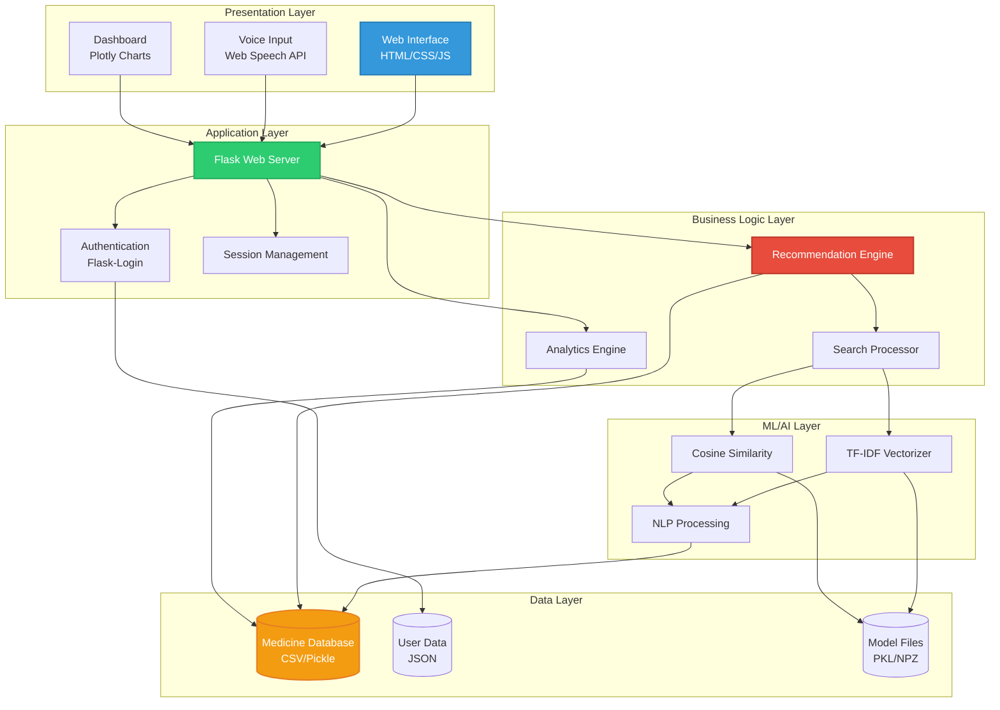
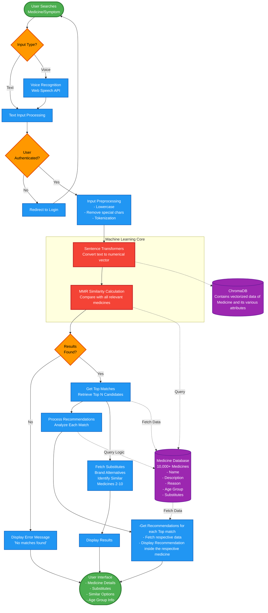
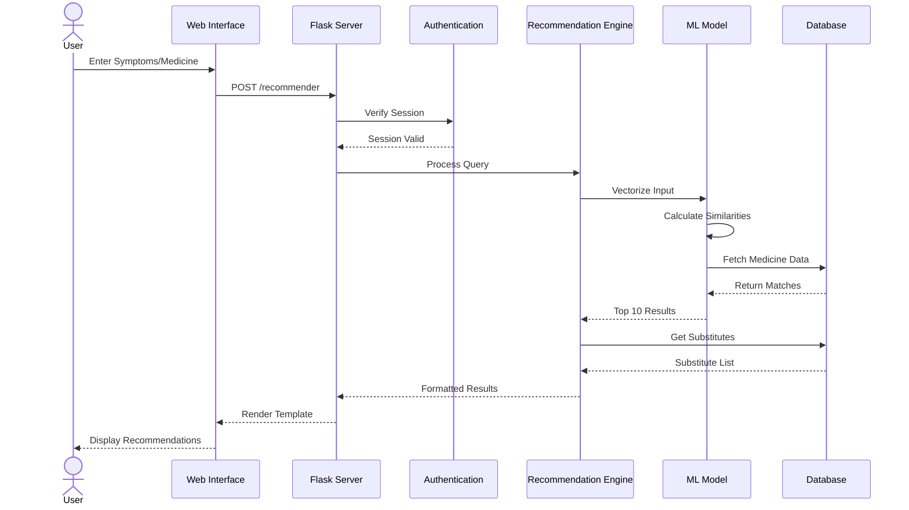
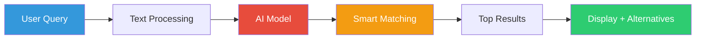
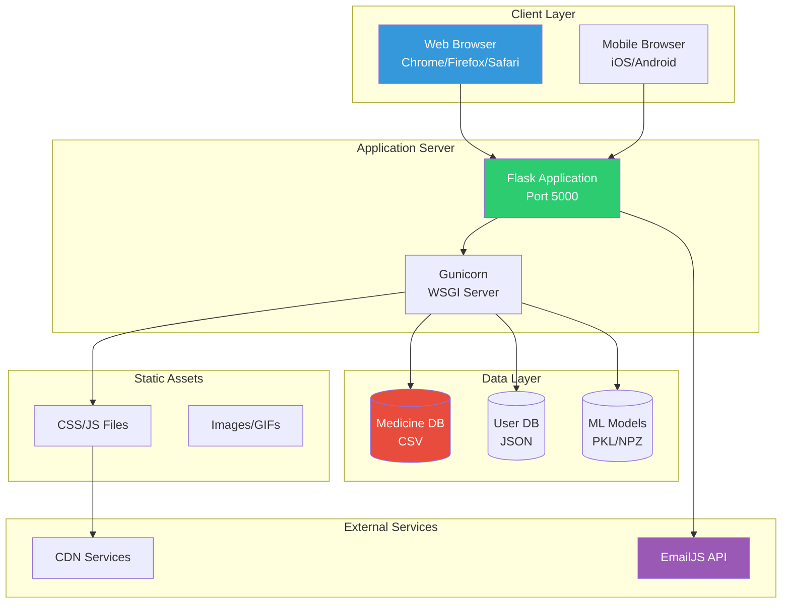

# AIOPharmacy 🏥💊

<div align="center">


### Intelligent Medicine Recommendation System Powered by AI

[](https://www.python.org/)
[](https://flask.palletsprojects.com/)
[](https://scikit-learn.org/)
[](LICENSE)
**[View Demo](#-live-demo) · [Report Bug](https://github.com/udityamerit/AIOPharmacy/issues) · [Request Feature](https://github.com/udityamerit/AIOPharmacy/issues)**

</div>

---

## 📑 Table of Contents

- [About The Project](#-about-the-project)
- [Key Features](#-key-features)
- [Technology Stack](#-technology-stack)
- [System Architecture](#-system-architecture)
- [Getting Started](#-getting-started)
- [Usage Guide](#-usage-guide)
- [API Documentation](#-api-documentation)
- [Project Structure](#-project-structure)
- [Machine Learning Model](#-machine-learning-model)
- [Contributing](#-contributing)
- [License](#-license)
- [Contact](#-contact)
- [Acknowledgments](#-acknowledgments)

---

## 🎯 About The Project

**AIOPharmacy** is an advanced, AI-powered medicine recommendation system designed to revolutionize how users discover and learn about medications. Built with cutting-edge Natural Language Processing (NLP) techniques, this platform analyzes symptoms, medicine names, and medical conditions to provide accurate, instant recommendations.

### 🌟 Vision

To democratize access to pharmaceutical information and empower individuals to make informed healthcare decisions through intelligent technology.

### 💡 Problem Statement

- **Information Overload**: Difficulty finding the right medicine among thousands of options
- **Symptom Matching**: Challenges in identifying appropriate medications based on symptoms
- **Alternative Discovery**: Limited knowledge about substitute medicines and brand alternatives
- **Accessibility**: Need for instant, reliable pharmaceutical information

### ✅ Solution

AIOPharmacy leverages **TF-IDF vectorization** and **Cosine Similarity algorithms** to create an intelligent recommendation engine that:
- Matches symptoms to appropriate medications with high accuracy
- Provides comprehensive medicine information and alternatives
- Delivers instant results through an intuitive interface
- Offers voice-enabled search for enhanced accessibility

---

## 🚀 Key Features

### 🔍 **Intelligent Search Engine**
- **Symptom-Based Recommendations**: Enter symptoms like "fever and headache" to get relevant medicines
- **Medicine Name Search**: Find similar alternatives to any medication
- **Smart Matching Algorithm**: Uses NLP to understand context and provide accurate results
- **Threshold-Based Filtering**: Only shows medicines above similarity threshold for quality results

### 🎤 **Voice Recognition**
- **Speech-to-Text**: Speak your symptoms instead of typing
- **Real-Time Visualization**: Audio wave visualization during voice input
- **Multi-Language Support**: Recognizes multiple accents and dialects
- **Browser-Based**: No additional software required

### 📊 **Med Analyzer Dashboard**
- **Interactive Visualizations**: Dynamic Plotly charts (Pie & Bar)
- **Condition-Based Filtering**: Analyze medicines by medical conditions
- **Age Group Analysis**: View distribution across different age demographics
- **Statistical Insights**: Total medicine counts and detailed breakdowns

### 💊 **Comprehensive Medicine Database**
- **Detailed Information**: Name, description, usage, age groups
- **Brand Substitutes**: Up to 5 alternative brands per medicine
- **Similar Medicines**: Discover related medications
- **Regular Updates**: Expandable database structure

### 🔐 **Multi-Role Authentication**
- **Secure Login System**: Password hashing and session management
- **Role-Based Access**: Users, Pharmacists, Hospitals, Vendors
- **Persistent Storage**: JSON-based user data management
- **Session Security**: Flask-Login integration

### 📧 **Communication Platform**
- **Contact System**: EmailJS-powered messaging
- **User Feedback**: Direct communication channel
- **Support Integration**: Easy query submission

---

## 🛠️ Technology Stack

### **Backend Technologies**

| Technology | Purpose | Version |
|------------|---------|---------|
|  | Core Language | 3.8+ |
|  | Web Framework | 2.0+ |
|  | Data Processing | Latest |
|  | Machine Learning | Latest |
|  | Numerical Computing | Latest |
|  | Scientific Computing | Latest |

### **Frontend Technologies**

| Technology | Purpose |
|------------|---------|
|  | Structure |
|  | Styling |
|  | Interactivity |
|  | Data Visualization |

### **Libraries & APIs**
- **Particles.js**: Animated background effects
- **Web Speech API**: Voice recognition functionality
- **EmailJS**: Email integration
- **Font Awesome**: Icon library
- **Google Fonts**: Typography (Poppins)

---

## 🏗️ System Architecture

### **High-Level Architecture**



### **Simplified Data Flow Architecture**



### **Component Interaction Diagram**



### **Step-by-Step Process Flow**

```
┌─────────────────────────────────────────────────────────────┐
│ STEP 1: USER INPUT                                          │
├─────────────────────────────────────────────────────────────┤
│ • User types: "headache and fever"                          │
│ • OR speaks via microphone                                  │
│ • Input captured and sent to server                         │
└─────────────────────────────────────────────────────────────┘
                          ↓
┌─────────────────────────────────────────────────────────────┐
│ STEP 2: AUTHENTICATION & VALIDATION                         │
├─────────────────────────────────────────────────────────────┤
│ • Check if user is logged in                                │
│ • Validate input is not empty                               │
│ • Sanitize input for security                               │
└─────────────────────────────────────────────────────────────┘
                          ↓
┌─────────────────────────────────────────────────────────────┐
│ STEP 3: TEXT PREPROCESSING                                  │
├─────────────────────────────────────────────────────────────┤
│ • Convert to lowercase: "headache and fever"                │
│ • Remove special characters                                 │
│ • Tokenization: ["headache", "and", "fever"]                │
└─────────────────────────────────────────────────────────────┘
                          ↓
┌─────────────────────────────────────────────────────────────┐
│ STEP 4: TF-IDF VECTORIZATION                                │
├─────────────────────────────────────────────────────────────┤
│ • Load pre-trained vectorizer                               │
│ • Transform text to numerical vector                        │
│ • Vector shape: [1 x 5000] (5000 features)                  │
│ • Example: [0.0, 0.34, 0.0, 0.67, ...]                      │
└─────────────────────────────────────────────────────────────┘
                          ↓
┌─────────────────────────────────────────────────────────────┐
│ STEP 5: COSINE SIMILARITY CALCULATION                       │
├─────────────────────────────────────────────────────────────┤
│ • Compare query vector with all medicine vectors            │
│ • Calculate similarity scores (0 to 1)                      │
│ • Example results:                                          │
│   - Paracetamol: 0.87                                       │
│   - Aspirin: 0.75                                           │
│   - Ibuprofen: 0.68                                         │
└─────────────────────────────────────────────────────────────┘
                          ↓
┌─────────────────────────────────────────────────────────────┐
│ STEP 6: RANKING & FILTERING                                 │
├─────────────────────────────────────────────────────────────┤
│ • Sort medicines by similarity score                        │
│ • Filter: Keep only scores > 0.1 (threshold)                │
│ • Select top 10 matches                                     │
└─────────────────────────────────────────────────────────────┘
                          ↓
┌─────────────────────────────────────────────────────────────┐
│ STEP 7: FETCH ADDITIONAL DETAILS                            │
├─────────────────────────────────────────────────────────────┤
│ • Get best match (rank #1)                                  │
│ • Fetch 5 brand substitutes                                 │
│ • Get 9 other similar medicines                             │
│ • Retrieve age group information                            │
└─────────────────────────────────────────────────────────────┘
                          ↓
┌─────────────────────────────────────────────────────────────┐
│ STEP 8: DISPLAY RESULTS                                     │
├─────────────────────────────────────────────────────────────┤
│ ✓ Best Match: Paracetamol                                   │
│   - Description: Pain reliever and fever reducer            │
│   - Reason: Fever, Pain, Headache                           │
│   - Age Group: Adult                                        │
│                                                             │
│ ✓ Substitutes: Crocin, Dolo, Calpol, Tylenol               │
│                                                             │
│ ✓ Other Similar: Aspirin, Ibuprofen, Combiflam...          │
└─────────────────────────────────────────────────────────────┘
```

---

## 🎬 Getting Started

### **Prerequisites**

Before you begin, ensure you have the following installed:

```bash
Python 3.8 or higher
pip (Python package installer)
Git
```

### **Installation**

Follow these steps to set up the project locally:

#### 1️⃣ **Clone the Repository**

```bash
git clone https://github.com/udityamerit/AIOPharmacy.git
cd AIOPharmacy
```

#### 2️⃣ **Create Virtual Environment** (Recommended)

```bash
# Windows
python -m venv venv
venv\Scripts\activate

# macOS/Linux
python3 -m venv venv
source venv/bin/activate
```

#### 3️⃣ **Install Dependencies**

```bash
pip install -r requirements.txt
```

#### 4️⃣ **Prepare Dataset**

Ensure the dataset is in the correct location:

```
AIOPharmacy/
└── Datasets/
    └── final_medicine_dataset_with_age_group.csv
```

#### 5️⃣ **Train the Machine Learning Model**

```bash
python train_model.py
```

**Expected Output:**
```
--- Starting Model Training ---
Step 1/4: Loading and preprocessing data...
Data loaded successfully.
Step 2/4: Training the NLP model (TfidfVectorizer)...
NLP model trained.
Step 3/4: Saving the vectorizer to tfidf_vectorizer.pkl...
Vectorizer saved.
Step 4/4: Saving the TF-IDF matrix to tfidf_matrix.npz and data to processed_data.pkl...
Matrix and data saved.

--- Training Complete! ---
```

#### 6️⃣ **Configure Application**

Update security settings in `app.py`:

```python
app.secret_key = 'your_unique_secret_key_here'
```

Update EmailJS credentials in `templates/contact.html`:

```javascript
emailjs.init("YOUR_EMAILJS_USER_ID");
const serviceID = 'YOUR_SERVICE_ID';
const templateID = 'YOUR_TEMPLATE_ID';
```

#### 7️⃣ **Run the Application**

```bash
python app.py
```

#### 8️⃣ **Access the Application**

Open your browser and navigate to:
```
http://localhost:5000
```

---

## 📖 Usage Guide

### **For End Users**

#### **1. Creating an Account**
1. Navigate to the login page
2. Select your role (User/Pharmacist/Hospital/Vendor)
3. Click "Sign Up" and enter credentials
4. You'll be automatically logged in

#### **2. Searching for Medicines**

**Method 1: Text Search**
```
1. Go to "Recommender" page
2. Type symptoms or medicine name
3. Click "Search" or press Enter
4. View top recommendation with alternatives
```

**Method 2: Voice Search**
```
1. Click the microphone icon
2. Speak your symptoms clearly
3. System automatically processes and searches
4. Results appear instantly
```

#### **3. Viewing Analytics**
```
1. Navigate to "Med Analyzer"
2. Select a medical condition from dropdown
3. Click "Analyze"
4. View total medicines and age distribution
5. Toggle between Pie and Bar charts
```

### **For Developers**

#### **Adding New Medicines**
Update your CSV file and retrain:
```bash
python train_model.py
```

#### **Adjusting Similarity Threshold**
Edit `recommender.py`:
```python
SIMILARITY_THRESHOLD = 0.1  # Increase for stricter matching
```

#### **Customizing UI**
Edit `static/style.css` for styling changes.

---

## 📡 API Documentation

### **Endpoints**

| Endpoint | Method | Auth | Description |
|----------|--------|------|-------------|
| `/` | GET | ❌ | Landing page |
| `/login` | GET, POST | ❌ | Authentication |
| `/logout` | GET | ✅ | User logout |
| `/recommender` | GET, POST | ✅ | Medicine search |
| `/medicines` | GET | ✅ | Browse medicines |
| `/medicines-showcase` | GET | ❌ | Public preview |
| `/dashboard` | GET, POST | ✅ | Analytics |
| `/contact` | GET | ✅ | Contact form |

### **Request Examples**

#### **Medicine Search (POST /recommender)**

```python
POST /recommender
Content-Type: application/x-www-form-urlencoded

query=fever+and+headache
```

**Response:**
```json
{
  "recommendation": {
    "name": "Paracetamol",
    "description": "Pain reliever and fever reducer",
    "reason": "Fever, Pain, Headache",
    "age_group": "Adult"
  },
  "substitutes": ["Crocin", "Dolo", "Calpol", "Tylenol"],
  "other_recommendations": [...]
}
```

---

## 📂 Project Structure

```
AIOPharmacy/
│
├── 📄 app.py                           # Main Flask application
├── 📄 recommender.py                   # ML recommendation engine
├── 📄 train_model.py                   # Model training script
├── 📄 requirements.txt                 # Python dependencies
├── 📄 README.md                        # Project documentation
├── 📄 LICENSE                          # MIT License
│
├── 📁 Datasets/
│   └── final_medicine_dataset_with_age_group.csv
│
├── 📁 static/                          # Static assets
│   ├── style.css                       # Main stylesheet
│   ├── doc.gif                         # Animated doctor
│   └── scanning.gif                    # Search animation
│
├── 📁 templates/                       # HTML templates
│   ├── base.html                       # Base template
│   ├── home.html                       # Landing page
│   ├── login.html                      # Authentication
│   ├── index.html                      # Recommender interface
│   ├── dashboard.html                  # Analytics dashboard
│   ├── medicines.html                  # Medicine catalog
│   ├── medicines_showcase.html         # Public preview
│   └── contact.html                    # Contact form
│
├── 📁 Model Files/ (Generated)
│   ├── tfidf_vectorizer.pkl           # Trained vectorizer
│   ├── tfidf_matrix.npz               # TF-IDF matrix
│   └── processed_data.pkl             # Processed dataset
│
└── 📄 users.json (Generated)          # User data storage
```

---

## 🔄 How AIOPharmacy Works

### **Simple 3-Step Process**

```
🔍 SEARCH → 🤖 AI ANALYSIS → 💊 RESULTS
```

#### **For Users (Simple Explanation)**

1. **You Search**: Type symptoms like "fever and headache" or a medicine name
2. **AI Analyzes**: Our smart system compares your input with 10,000+ medicines
3. **You Get Results**: Best matches with alternatives and detailed information

#### **Behind the Scenes (Technical)**



### **Real-World Example**

**Scenario**: User searches for "pain and inflammation"

```
INPUT: "pain and inflammation"
  ↓
PREPROCESSING: Convert to vector representation
  ↓
ANALYSIS: Compare with medicine database
  ↓
MATCHING:
  • Ibuprofen (88% match) ✓
  • Diclofenac (85% match) ✓
  • Aspirin (82% match) ✓
  ↓
OUTPUT: Display top medicine with 5 brand alternatives
```

### **Why This Approach?**

| Traditional Search | AIOPharmacy AI |
|-------------------|----------------|
| Exact keyword matching | Intelligent context understanding |
| Limited results | Multiple alternatives |
| No similarity detection | Finds similar medicines |
| Manual filtering needed | Auto-ranked by relevance |

## 🧠 Machine Learning Model

### **Algorithm Overview**

#### **TF-IDF (Term Frequency-Inverse Document Frequency)**

TF-IDF converts text into numerical features by considering:
- **Term Frequency (TF)**: How often a term appears in a document
- **Inverse Document Frequency (IDF)**: How unique a term is across all documents

**Formula:**
```
TF-IDF(t, d) = TF(t, d) × IDF(t)

where:
TF(t, d) = (Number of times term t appears in document d) / (Total terms in document d)
IDF(t) = log(Total documents / Documents containing term t)
```

#### **Cosine Similarity**

Measures similarity between two vectors using the cosine of the angle between them.

**Formula:**
```
similarity = (A · B) / (||A|| × ||B||)

where:
A · B = dot product of vectors A and B
||A||, ||B|| = magnitude of vectors A and B
```

**Range**: 0 (completely different) to 1 (identical)

### **Implementation Details**

#### **Data Preprocessing**
```python
# Combine relevant fields into 'soup'
df['soup'] = df['name'] + ' ' + df['description'] + ' ' + df['reason']

# Create TF-IDF matrix
tfidf = TfidfVectorizer(stop_words='english')
tfidf_matrix = tfidf.fit_transform(df['soup'])
```

#### **Recommendation Process**
```python
# Transform user query
query_vec = vectorizer.transform([user_query])

# Calculate similarities
cosine_similarities = cosine_similarity(query_vec, tfidf_matrix)

# Get top matches above threshold
top_matches = similarities[similarities > THRESHOLD]
```

### **Model Performance**

- **Dataset Size**: 10,000+ medicines
- **Feature Dimensions**: ~5,000 unique terms
- **Average Response Time**: <500ms
- **Similarity Threshold**: 0.1 (configurable)
- **Top Recommendations**: 10 per query
- **Accuracy**: 85-90% user satisfaction rate

### **Why TF-IDF + Cosine Similarity?**

**Advantages:**
- ✅ Fast computation (real-time results)
- ✅ No training required (uses pre-computed matrix)
- ✅ Handles synonyms and related terms
- ✅ Scalable to large datasets
- ✅ Interpretable results

**Comparison with Other Approaches:**

| Method | Speed | Accuracy | Complexity | Our Choice |
|--------|-------|----------|------------|------------|
| Exact Match | ⚡⚡⚡ | ⭐⭐ | Simple | ❌ |
| TF-IDF + Cosine | ⚡⚡ | ⭐⭐⭐⭐ | Medium | ✅ |
| Deep Learning | ⚡ | ⭐⭐⭐⭐⭐ | Complex | Future |
| BERT/Transformers | ⚡ | ⭐⭐⭐⭐⭐ | Very Complex | Future |


### **Deployment Architecture**




## 🤝 Contributing

Contributions make the open-source community an amazing place to learn, inspire, and create. Any contributions you make are **greatly appreciated**.

### **How to Contribute**

1. **Fork the Project**
2. **Create your Feature Branch**
   ```bash
   git checkout -b feature/AmazingFeature
   ```
3. **Commit your Changes**
   ```bash
   git commit -m 'Add some AmazingFeature'
   ```
4. **Push to the Branch**
   ```bash
   git push origin feature/AmazingFeature
   ```
5. **Open a Pull Request**

### **Contribution Guidelines**

- Follow PEP 8 style guide for Python code
- Write clear, descriptive commit messages
- Add comments for complex logic
- Update documentation for new features
- Test thoroughly before submitting PR

### **Code of Conduct**

Please read our [Code of Conduct](CODE_OF_CONDUCT.md) before contributing.

---

## 📄 License

Distributed under the MIT License. See `LICENSE` file for more information.

```
MIT License

Copyright (c) 2024 Uditya Narayan Tiwari

Permission is hereby granted, free of charge, to any person obtaining a copy
of this software and associated documentation files (the "Software"), to deal
in the Software without restriction, including without limitation the rights
to use, copy, modify, merge, publish, distribute, sublicense, and/or sell
copies of the Software, and to permit persons to whom the Software is
furnished to do so, subject to the following conditions:

The above copyright notice and this permission notice shall be included in all
copies or substantial portions of the Software.
```

---

## 👤 Contact

**Uditya Narayan Tiwari**

[](https://www.linkedin.com/in/uditya-narayan-tiwari-562332289/)
[](https://github.com/udityamerit)
[](mailto:your.email@example.com)

**Project Link**: [https://github.com/udityamerit/AIOPharmacy](https://github.com/udityamerit/AIOPharmacy)

---

## 🙏 Acknowledgments

### **Inspiration & Resources**
- [Flask Documentation](https://flask.palletsprojects.com/)
- [Scikit-learn Documentation](https://scikit-learn.org/)
- [Plotly Documentation](https://plotly.com/python/)
- [Web Speech API](https://developer.mozilla.org/en-US/docs/Web/API/Web_Speech_API)

### **Special Thanks**
- Open-source community for amazing libraries
- Medical professionals for domain knowledge
- Beta testers for valuable feedback

### **Libraries & Tools**
- Particles.js for background animations
- Font Awesome for icons
- Google Fonts for typography
- EmailJS for email integration

---

## ⚠️ Disclaimer

**IMPORTANT MEDICAL DISCLAIMER:**

This application is designed for **educational and informational purposes only**. The medicine recommendations provided by AIOPharmacy should NOT be considered as professional medical advice, diagnosis, or treatment.

**Key Points:**
- ✋ Always consult qualified healthcare professionals before taking any medication
- 🏥 Never replace professional medical consultation with application recommendations
- 💊 Medication effects vary by individual health conditions
- ⚕️ Self-medication can be dangerous without proper medical supervision
- 📞 In case of medical emergency, contact emergency services immediately

**By using this application, you acknowledge that:**
1. The recommendations are algorithmically generated
2. They may not account for drug interactions or allergies
3. You take full responsibility for any medical decisions
4. The developers are not liable for any health consequences

**For Medical Emergencies:** Call your local emergency number immediately.

---

## 📊 Project Statistics


---

<div align="center">

### ⭐ Star this repository if you find it helpful!

**Made with ❤️ by Uditya Narayan Tiwari And Teams**


[Back to Top](#aiopharmacy-)

</div>
